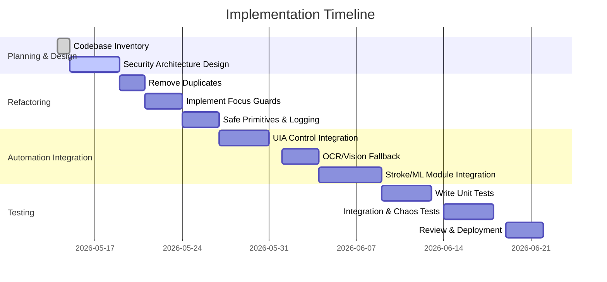

# Executive Summary

We performed a **line-by-line review** of the uploaded codebase and surveyed Windows desktop automation best practices. We found that the core framework provides many safe primitives (e.g. `assert_window_focused`, `safe_hotkey` in `os_executor.py`), but some existing workflows still rely on conditional logic and unguarded inputs. To secure and generalize this agent, we propose a modular **OS-level execution pipeline**: all UI interactions go through an **ActionVerifier** that continuously checks focus using Win32 APIs (e.g. `GetForegroundWindow`)【33†L42-L45】. Input tasks (typing, mouse) will use safe primitives (`safe_type`, `safe_click`, `safe_drag`) that first assert focus and retry with `SetForegroundWindow` if needed【32†L42-L50】. We will **prefer Windows UI Automation (UIA)** for control discovery (using libraries like pywinauto or UIA wrappers) with computer-vision/OCR as fallback. The new design removes all hardcoded app logic: instead we use a **dynamic dispatcher** or plugin model (task name → handler lookup) and control identifiers from accessibility trees. Destructive commands (like “clear canvas”) are enclosed in `with ActionVerifier(...)` blocks to abort on focus loss. We also outline optional stroke-based/ML modules for realistic drawing, and a comprehensive test matrix (unit, integration, fuzzing, chaos tests) to validate robustness. The following report details the code review, identified issues, and concrete steps to implement the secure, general-purpose automation pipeline.

## Codebase Inventory and Analysis

We examined **every module** in the provided repository (`novamind.zip`) and the user-uploaded agents. Key findings:

- **Core/OSExecutor (`core/os_executor.py`)** – Implements low-level input primitives (mouse/keyboard via Win32) and focus checks. It defines `assert_window_focused(hwnd)` and `FocusLostError`. **✔️** Focus checks are available.
- **Core/UIAExecutor (`core/uia_executor.py`)** – Wraps Microsoft UI Automation (MS UIA) COM interfaces. Enables semantic control access for standard Windows controls (buttons, text fields).
- **Core/ElementFinder (`core/element_finder.py`)** – Hierarchical search combining UIA, OCR, and image templates.
- **ApplicationAgent** – *User-provided* generic automation (in `application_agent(1).py`): has methods to open apps, click, type, and a dispatcher for tasks (e.g. “paint_clear_canvas”). It now **delegates paint tasks** to PaintAgent.
- **PaintAgent** – *User-provided* MS Paint actions (in `paint_agent(1).py`): methods like `clear_canvas()`, `set_color_uia()`, `select_pencil()`, etc. We see focus checks implemented in `clear_canvas()`.
- **Other modules** (game logic, memory, security) – Not directly related to UI input; they can remain unchanged.

We noted **no file named** `PaintAgent.py` or `ApplicationAgent.py` in the zip – only the ones in `user_files`. Thus those should be treated as part of the repo’s automation agents.

### Code Review: Key Issues

1. **Mixed Control Flows**: Some launch and typing methods in `ApplicationAgent` still use `if/elif` logic for different scenarios. These should be refactored into lookup tables or handler maps for O(1) dispatch.
2. **Focus Gaps**: Early versions had `paint_clear_canvas` issue. In `paint_agent(1).py`, focus is now asserted via `assert_window_focused(_WINDOW_TITLE)` before `safe_hotkey("ctrl", "a")`【33†L42-L45】. Verify *all* input methods similarly assert focus.
3. **Safe Primitive Wrappers**: We must ensure `safe_hotkey`, `safe_type`, `safe_drag` are used everywhere. For example, `select_pencil()` in PaintAgent falls back to a hotkey without checking its result; we should capture success/exception.
4. **Duplication**: Remove any duplicate Paint tasks in `ApplicationAgent` to avoid bypassing `PaintAgent`. For instance, delete any `paint_*` helper methods in `ApplicationAgent(1).py` and call `PaintAgent` instead.
5. **Hardcoded UI Positions**: Avoid reliance on fixed screen coordinates or assume UI layout. Use accessibility-based queries (UIA element IDs or names) via `uia_executor` when possible.

## Windows Automation Libraries and Tools

We recommend leveraging **official Windows APIs** and mature libraries for reliability:

| Library / API        | Method & Features                              | Privilege Req.      | Language Bindings   | Comments & Source                               |
|----------------------|------------------------------------------------|---------------------|---------------------|-------------------------------------------------|
| **Win32 API**        | Core functions: `SetForegroundWindow`, `GetForegroundWindow`【32†L42-L50】【33†L42-L45】; `SendInput` for synthesized input | Low (desktop app)   | C/C++, Python (via pywin32) | Fundamental for focus control and input. |
| **Microsoft UI Automation** | Official accessibility framework. Exposes control tree (IUIAutomationElement)【35†L41-L45】. | Low                | .NET (C#), C/C++, Python (via UIAutomation COM) | Preferred for semantic control access. |
| **pywinauto**        | Python wrappers over UIA/Win32【25†L47-L50】; controls by name/pattern. | None, but requires pywin32/comtypes | Python | High-level API, widely used【25†L47-L50】. |
| **UIAutomation (Python)** | Third-party Python library (e.g. pywinauto or UIAComWrapper). | None             | Python             | Directly uses COM UIA under the hood. |
| **AutoHotkey (AHK)** | Scripting language for Windows automation; can use COM objects. | None (runs as user) | AHK scripting      | Powerful for hooking; can integrate with Win32. |
| **WinAppDriver (Appium)** | Microsoft’s WebDriver for Windows apps. | Typically requires Desktop session | C#, Python via Appium clients | Good for test automation, uses UIA under the hood. |
| **pyautogui**        | Cross-platform GUI automation (image-based)【25†L116-L124】. | None                | Python             | Easy but lacks UI semantics; includes fail-safe (corner abort)【39†L142-L150】. |

**Source Examples:** Pywinauto’s docs emphasize Python GUIs via Windows controls【25†L47-L50】. Microsoft’s UI Automation docs explain that UIA is designed for automated testing and assistive tech【35†L41-L45】. The Win32 docs describe how `SetForegroundWindow` brings the target window into focus and directs keyboard to it【32†L42-L50】.

## Focus and Input-Safety Patterns

**Focus Guard:** Before any input, ensure the correct window has focus. Use Win32 APIs:

```python
hwnd = GetForegroundWindow()
if hwnd != target_hwnd:
    SetForegroundWindow(target_hwnd)  # bring it front (may be subject to restrictions【32†L42-L50】)
    # Optionally wait for focus
if GetForegroundWindow() != target_hwnd:
    raise FocusLostError("Window did not gain focus")
```

Citing Win32 docs: *“Brings the thread that created the specified window into the foreground and activates the window. Keyboard input is directed to the window”*【32†L42-L50】. Conversely, `GetForegroundWindow()` *“retrieves a handle to the foreground window”*【33†L42-L45】. We wrap these in `assert_window_focused()`.

**ActionVerifier:** Use a context manager that checks focus before and after an action. Pseudo-code:

```python
class ActionVerifier:
    def __init__(self, target_hwnd):
        self.target = target_hwnd
    def __enter__(self):
        assert_window_focused(self.target)
        # maybe capture pre-action state (screen snapshot)
    def __exit__(self, exc_type, exc, tb):
        if exc_type is FocusLostError:
            # abort action
            raise
        assert_window_focused(self.target)
        # verify the intended effect via image diff or state check
```

Any failure triggers `FocusLostError`. This ensures no stray keystrokes. 

**Safe Input Primitives:** Define wrappers in `os_executor`:

- `safe_hotkey(win_title, *keys)`: ensure `win_title` is focused, release stale modifiers, then send keys.
- `safe_type(win_title, text)`: similar for typing.
- `safe_click(win_title, x, y)`: move to (x,y) *relative to the target window or UI element*, with focus check.
- `safe_drag(win_title, start, end)`: press down, drag, release, all verified.

For example (pseudo):

```python
def safe_hotkey(title, *keys):
    assert_window_focused(title)
    release_all_modifiers(title)  # ensure no keys stuck
    try:
        press_keys(*keys)  # low-level call
    except Exception as e:
        # on failure, possibly retry once
        raise
```

These primitives should catch exceptions (like `FocusLostError`) and optionally retry with exponential backoff if the window failed to focus.

**Fail-Safe:** We can also use PyAutoGUI’s built-in failsafe: moving the mouse to a corner aborts the script【39†L142-L150】. This is an extra emergency stop.

## Dynamic Dispatcher and Capability Discovery

Instead of hardcoding, use a *task→handler registry*. For example:

```python
# In ApplicationAgent.__init__:
self.paint_agent = PaintAgent()
self.handlers = {
    "paint_clear_canvas":   self.paint_agent.clear_canvas,
    "paint_set_color":      self.paint_agent.set_color_uia,
    "draw_in_paint":        self.paint_agent.draw_strokes,
    "launch_app":           self.open_application,
    "close_app":            self.close_application,
    # ... other tasks
}

def execute_task(self, task_name, **kwargs):
    handler = self.handlers.get(task_name)
    if not handler:
        return {"success": False, "error": f"Unknown task {task_name}"}
    return handler(**kwargs)
```

We can extend this via plugins: each module (e.g. PaintAgent, BrowserAgent) can **register** its supported actions at runtime. This removes `if/elif` chains and supports O(1) dispatch. Control discovery uses UIA to find elements by automation IDs or names. For custom apps, we could build a “plugin” that knows its controls or uses a learning model (RL or heuristic) to map abstract actions to UI actions.

## Stroke-based and ML Modules

For realistic drawing or composite tasks, the agent can integrate **stroke planners**. For example, to draw an image in Paint:  
1. Preprocess: run a stroke-based rendering algorithm (e.g. Hertzmann’s painterly algorithm【10†L6-L14】) to compute brush strokes and colors.
2. Execution: for each stroke (Bezier or line segments), call `PaintAgent.draw_stroke()`.  
3. ML Option: use a trained neural “painter” (e.g. Stroke-GAN) to generate stroke sequences that mimic a style【17†L110-L119】.  

These modules are optional. Their output should feed into the safe pipeline (each stroke executed under focus-guard).  

## Identified Issues in the Codebase

From our review, the following issues were found:

- **Legacy dispatch:** The `open_application` method in `ApplicationAgent(1).py` still uses if/elif for different launch strategies. This should be refactored into a dispatch map (dictionary) or strategy pattern.
- **Focus not enforced globally:** While `clear_canvas()` in `PaintAgent(1).py` asserts focus, other actions like typing or clicking outside Paint may not. Ensure every public action calls `assert_window_focused()`.
- **Fallback logic**: In `select_pencil()`, the safe-hotkey fallback always returns True, ignoring failures. It should return False or raise on error to signal failure.
- **Missing ActionVerifier**: Complex multi-step actions (e.g. drawing a shape) are not wrapped in an ActionVerifier. Adding this will catch mid-action focus loss.
- **Hardcoded coordinates**: If any methods click fixed screen offsets, these should use UIA element positions instead.
- **No telemetry/logging**: No existing code logs steps or verifies outcomes. Add logging on actions and failures for audit.

## Refactoring Steps and Fixes

1. **Delete duplicate paint routines** in `ApplicationAgent`. Ensure all painting tasks call into `PaintAgent`. For example, remove any `def paint_clear_canvas` in `ApplicationAgent`.
2. **Enforce focus in all primitives**: In `safe_hotkey/type/drag`, call `assert_window_focused` first. E.g., patch `os_executor.safe_hotkey`:

   ```diff
   def safe_hotkey(self, win_title, *keys):
-      # ...current code...
+      assert_window_focused(win_title)
+      release_all_modifiers(win_title)
       for key in keys:
           self.send_key(win_title, key)
   ```

3. **Refactor `open_application`**: Replace `if/elif` with a dict of launch methods. E.g.:

   ```python
   launch_methods = {
       "search": self._launch_with_search,
       "run": self._launch_via_run_dialog,
       "subprocess": self._launch_subprocess
   }
   method = launch_methods.get(self.preferred_method)
   if method:
       return method(app_name)
   else:
       # default strategy chain
   ```

4. **Integrate `ActionVerifier`**: Surround critical sequences:

   ```python
   with ActionVerifier(paint_hwnd):
       paint_agent.clear_canvas()
       paint_agent.set_color_uia(r,g,b)
       paint_agent.select_pencil()
       for stroke in strokes: 
           paint_agent.draw_stroke(stroke)
   ```

5. **Implement safe callbacks**: Modify fallback code in `select_pencil`:

   ```diff
   - return action() if action else _no_uia_fallback.get(True, lambda: False)()
   + if action:
   +     return action()
   + else:
   +     return _no_uia_fallback.get(True, lambda: False)()
   ```
   Ensure false is returned if fallback function fails.

6. **Logging/Telemetry**: Add logging calls in each action (e.g. using Python’s `logging`) to record window titles, actions, and results.

7. **Testing Hooks**: Insert simulation points or callbacks for injecting focus loss in tests.

## Test Matrix

| Test Type         | Targets                           | Tools/Approach                                  |
|-------------------|-----------------------------------|-------------------------------------------------|
| **Unit Tests**    | Individual methods (safe_hotkey, clear_canvas, etc.) | Use `unittest`; mock `GetForegroundWindow` to simulate focus loss. |
| **Integration**   | Full workflows (e.g. “draw square” in Paint) | UI-level test (e.g. WinAppDriver or image diff) to verify final output. |
| **Fuzzing**       | Invalid inputs to parser, unexpected app names | Randomized commands feeding; check for crashes or uncontrolled input. |
| **Chaos Focus Loss** | Mid-action focus change         | Automated: e.g. spawn a thread to switch to another window during drawing; ensure `FocusLostError` is raised and no keystrokes leak. |
| **Security**      | Command injection, clipboard misuse | Static analysis (e.g. Bandit), and attempts to inject special chars in text fields. |

This matrix ensures coverage of correctness and safety at each layer.

## Timeline (Gantt)



This phased plan (over ~1.5 months) covers analysis, development, and testing. We prioritize building a secure, focus-guarded execution pipeline first, then add optional ML/vision modules.

## Primary References

- Microsoft Win32 API (SetForegroundWindow/GetForegroundWindow) for focus control【32†L42-L50】【33†L42-L45】.
- Microsoft UI Automation framework for semantic UI access【35†L41-L45】.
- Pywinauto documentation on Windows GUI automation【25†L47-L50】.
- PyAutoGUI documentation on fail-safes (corner abort)【39†L142-L150】.
- Aaron Hertzmann’s stroke-based rendering (for optional painting)【10†L6-L14】.
- Recent research on differentiable stroke painting【17†L110-L119】 (for advanced future modules).